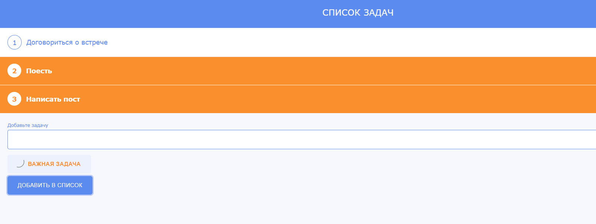

# to-do-list
# 🌐 Личный сайт / Frontend-проект
Простой одностраничный сайт, представляющий написание списка задач с выбором приоритета, без возможности пометить задачу выполненной.

## 📁 Структура проекта
- `todolist.html` — Главная страница
- `style.css` — Стилизация
- `script.js` — Основной скрипт
- `/img/` — Изображения

## 🛠 Использовано:
- HTML5
- CSS3
- JavaScript (ES6)

## 📸 Превью

## 🚀 Запуск
Открой файл `todolist.html` в браузере — сайт готов!

## 📌 Автор
[Мария Авдеева](https://github.com/marywwer)
